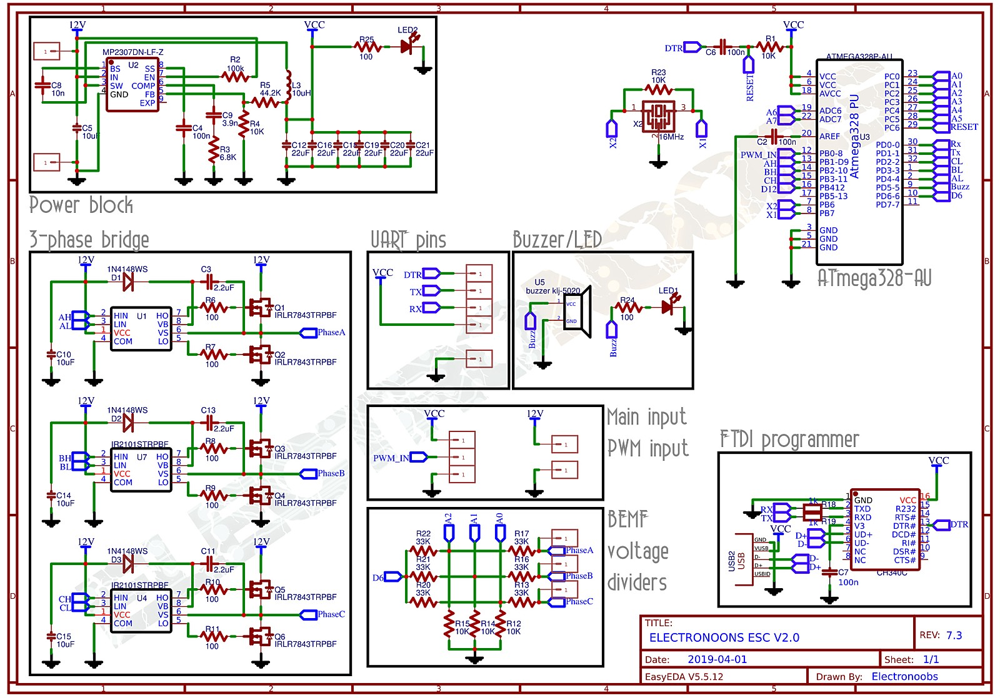

# ESC
*   Title: ELECTRONOOBS open source electronic speed controller.
*   Date: 02/04/2019
*   UPDATE: 06/07/2019
*   Version: 3.3
*   Author: http://electronoobs.com
*   Tutorial link: https://www.electronoobs.com/eng_arduino_tut91.php
*   Schematic link: https://www.electronoobs.com/eng_arduino_tut91_sch1.php
*   PCB gerbers: https://www.electronoobs.com/eng_arduino_tut91_gerbers1.php
*   This is a sensorless ESC based on Arduino with the ATmega328 chip. It uses
*   BEMF with the internal comparator of the ATmega328 to detect the rotor position.
*   The speed control is made by a PWM signal. Feel free to change it and improve
   it however you want
*   Subscribe: http://youtube.com/c/ELECTRONOOBS

## [1. 회로도]


---
## [소스]
```

```
---


